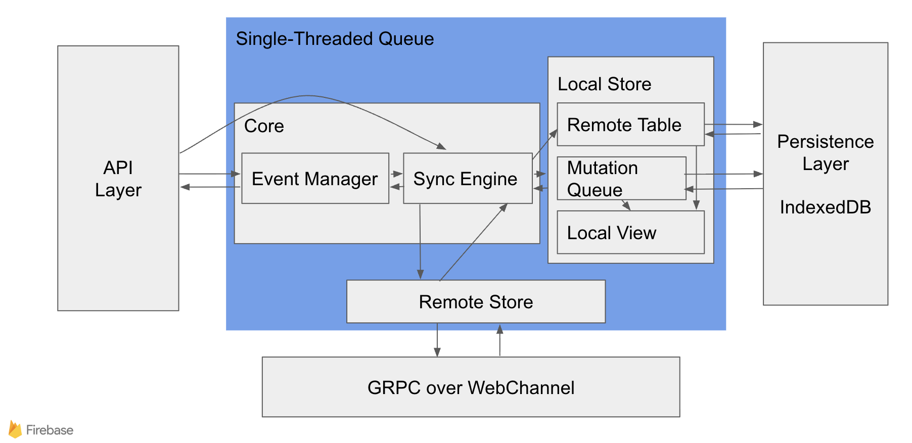

# SDK Architecture

This document provides a detailed explanation of the Firestore JavaScript SDK's architecture, its core components, and the flow of data through the system.

## Core Components

The SDK is composed of several key components that work together to provide the full range of Firestore features.

*   **API Layer**: The public-facing API surface that developers use to interact with the SDK. This layer is responsible for translating the public API calls into the internal data models and passing them to the appropriate core components.
*   **Core**:
    *   **Event Manager**: Acts as a central hub for all eventing in the SDK. It is responsible for routing events between the API Layer and Sync Engine. It manages query listeners and is responsible for raising snapshot events, as well as handling connectivity changes and some query failures.
    *   **Sync Engine**: The central controller of the SDK. It acts as the glue between the Event Manager, Local Store, and Remote Store. Its responsibilities include:
        *   Coordinating and translating client requests and remote events from the backend.
        *   Initiating responses to user code from both remote events (backend updates) and local events (e.g. garbage collection).
        *   Managing a "view" for each query, which represents the unified view between the local and remote data stores.
        *   Deciding whether a document is in a "limbo" state (e.g. its state is unknown) and needs to be fetched from the backend.
        *   Notifying the Remote Store when the Local Store has new mutations that need to be sent to the backend.
        *   For web clients, synchronizing query and mutation states across multiple tabs.
*   **Local Store**: A container for the components that manage persisted and in-memory data.
    *   **Remote Table**: A cache of the most recent version of documents as known by the Firestore backend.
    *   **Mutation Queue**: A queue of all the user-initiated writes (set, update, delete) that have not yet been acknowledged by the Firestore backend.
    *   **Local View**: A cache that represents the user's current view of the data, combining the Remote Table with the Mutation Queue.
    *   **Overlays**: A performance-optimizing cache that stores the calculated effect of pending mutations from the Mutation Queue on documents. Instead of re-applying mutations every time a document is read, the SDK computes this "overlay" once and caches it, allowing the Local View to be constructed more efficiently.
*   **Remote Store**: The component responsible for all network communication with the Firestore backend. It manages the gRPC streams for reading and writing data, and it abstracts away the complexities of the network protocol from the rest of the SDK.
*   **Persistence Layer**: The underlying storage mechanism used by the Local Store to persist data on the client. In the browser, this is implemented using IndexedDB.

The architecture and systems within the SDK map closely to the directory structure, which helps developers navigate the codebase. Here is a mapping of the core components to their corresponding directories.

*   `src/`:
    *   `api/`: Implements the **API Layer** for the main SDK.
    *   `lite-api/`: Implements the **API Layer** for the lite SDK.
    *   `core/`: Implements the **Sync Engine** and **Event Manager**.
    *   `local/`: Implements the **Local Store**, which includes the **Mutation Queue**, **Remote Table**, **Local View**, **Overlays** and the **Persistence Layer**.
    *   `remote/`: Implements the **Remote Store**, handling all network communication.

For a more detailed explanation of the contents of each directory, see the [Code Layout](./code-layout.md) documentation.

## Overview of features

At a high level, all interactions with Firestore can be categorized as either reading or writing data. The SDK provides different mechanisms for these operations, each with distinct guarantees and performance characteristics. There is also a special case of writing data called tansactions detailed below.

### Read Operations

There are two fundamental ways to read data from Firestore:

*   **One-Time Reads**: This is for fetching a snapshot of data at a specific moment. It's a simple request-response model. You ask for a document or the results of a query, and the server sends back the data as it exists at that instant.

*   **Real-Time Listeners**: This allows you to subscribe to a document or a query. The server first sends you the initial data and then continues to push updates to your client in real time as the data changes. This is the foundation of Firestore's real-time capabilities.

When a query is executed, the SDK immediately returns data from the local cache, which includes any pending optimistic writes from the **Mutation Queue**. This provides a fast, responsive experience. At the same time, the SDK sends the query to the Firestore backend to fetch the latest version of the documents. When the fresh documents arrive from the backend, the SDK takes these server-authoritative documents and re-applies any pending mutations from the local queue on top of them. It then re-runs the original query against this newly merged data. If the documents still match the query's criteria, they are delivered to the query listener again. This is a common occurrence and means a listener could see an event for the same document twice: first with the cached, optimistic data, and a second time after the backend data is reconciled.

### Write Operations

All data modifications—creates, updates, and deletes—are treated as "writes." The SDK is designed to make writes atomic and resilient.  There are two fundamental ways to write data to Firestore:

*   **One-Time Writes**: When a user performs a write (create, update, or delete), the operation is not sent directly to the backend. Instead, it's treated as a "mutation" and added to the local **Mutation Queue**. The SDK "optimistically" assumes the write will succeed on the backend and immediately reflects the change in the local view of the data, making the change visible to local queries. The SDK then works to synchronize this queue with the backend. This design is crucial for supporting offline functionality, as pending writes can be retried automatically when network connectivity is restored.

*   **Transactions**: For grouping multiple write operations into a single atomic unit, the SDK provides `runTransaction`. Unlike standard writes, transactions do not use the optimistic, offline-capable write pipeline. Instead, they are sent directly to the backend, which requires an active internet connection. This ensures atomicity but means transactions do not benefit from the offline capabilities of the standard write pipeline.

### Data Bundles

A Firestore data bundle is a serialized collection of documents and query results, created on a server using the Firebase Admin SDK. Bundles are used to efficiently deliver a pre-packaged set of data to the client, which can then be loaded directly into the SDK's local cache. This is useful for:

*   **Optimizing Server-Side Rendering (SSR)**: Bundles enable efficient hydration of client-side applications with data pre-fetched during server-side rendering, reducing initial load times and backend roundtrips.
*   **Seeding initial data** for an application, allowing users to have a complete offline experience on their first use.
*   **Distributing curated datasets** to clients in a single, efficient package.

When a bundle is loaded, its contents are unpacked and stored in the local cache, making the data available for immediate querying without needing to connect to the Firestore backend. For more details, see the [Bundles documentation](./bundles.md).

# Data Flow

Here's a step-by-step walkthrough of how data flows through the SDK for a write operation, referencing the core components.

## Write Data Flow

1.  **API Layer**: A user initiates a write operation (e.g., `setDoc`, `updateDoc`, `deleteDoc`).
2.  **Sync Engine**: The call is routed to the Sync Engine, which wraps the operation in a "mutation".
3.  **Mutation Queue (in Local Store)**: The Sync Engine adds this mutation to the Mutation Queue. The queue is persisted to the **Persistence Layer** (IndexedDB). At this point, the SDK "optimistically" considers the write successful locally.
4.  **Local View (in Local Store)**: The change is reflected in the Local View. This is done by creating or updating a cached **Overlay** for the affected document, making the change efficiently available to any active listeners without waiting for backend confirmation.
5.  **Remote Store**: The Sync Engine notifies the Remote Store that there are pending mutations.
6.  **Backend**: The Remote Store sends the mutations from the queue to the Firestore backend.
7.  **Acknowledgement**: The backend acknowledges the write.
8.  **Mutation Queue (in Local Store)**: The Remote Store informs the Sync Engine, which then removes the acknowledged mutation from the Mutation Queue.

## Read Data Flow (with a Real-Time Listener)

1.  **API Layer**: A user attaches a listener to a query (e.g., `onSnapshot`).
2.  **Event Manager**: The Event Manager creates a listener and passes it to the Sync Engine.
3.  **Sync Engine**: The Sync Engine creates a "view" for the query.
4.  **Local View (in Local Store)**: The Sync Engine asks the Local Store for the current documents matching the query. The Local Store provides these by applying cached **Overlays** on top of the documents to reflect optimistic local changes from the **Mutation Queue**.
5.  **API Layer**: The initial data from the Local View is sent back to the user's `onSnapshot` callback. This provides a fast, initial result.
6.  **Remote Store**: Simultaneously, the Sync Engine instructs the Remote Store to listen to the query on the Firestore backend.
7.  **Backend**: The backend returns the initial matching documents for the query.
8.  **Remote Table (in Local Store)**: The Remote Store receives the documents and saves them to the Remote Table in the Local Store, overwriting any previously cached versions of those documents.
9.  **Sync Engine**: The Sync Engine is notified of the updated documents. It re-calculates the query view by combining the new data from the Remote Table with any applicable pending mutations from the **Mutation Queue**.
10. **API Layer**: If the query results have changed after this reconciliation, the new results are sent to the user's `onSnapshot` callback. This is why a listener may fire twice initially.
11. **Real-time Updates**: From now on, any changes on the backend that affect the query are pushed to the Remote Store, which updates the Remote Table, triggering the Sync Engine to re-calculate the view and notify the listener.

## Bundle Loading Data Flow

1.  **API Layer**: The user initiates a bundle load via the public API.
2.  **Sync Engine**: The Sync Engine receives the bundle and begins processing it.
3.  **Local Store**: The Sync Engine unpacks the bundle and saves its contents (documents and named queries) into the **Local Store**.
4.  **API Layer**: The user is notified of the progress and completion of the bundle loading operation via the task returned by the API.